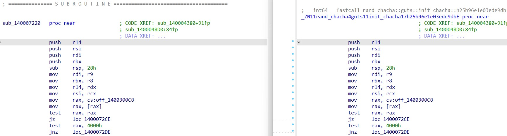

[](https://github.com/N0fix/Ariane/actions/workflows/build.yml)
[](https://opensource.org/licenses/MIT)


Ariane is a tool that attempts to identify functions in Rust PE executables when no debug information is available.
It focuses on having minimal dependencies on other tools.



*Before/After symbol recovery*

## Warning

**This tool is currently in an experimental phase and should not be considered as complete and accurate.**

**It is inspired by [Cerberus](https://github.com/h311d1n3r/Cerberus/tree/main) and implement similar principles, but for PE files.**

**It is windows only.**

## Installation

```
git clone https://github.com/N0fix/Ariane
cd Ariane
cargo install --path .
```

## External dependencies

Please make sure you have to following dependencies installed : 

- [rustup](https://rustup.rs/)
- [cargo](https://www.rust-lang.org/tools/install) (comes with rust default installation)

## Usage

Multiple commands are available : 
```
Usage: ariane.exe <COMMAND>

Commands:
  info      Print recognized dependencies
  download  Download and extract recognized dependencies to target directory
  recover   Try to recover symbols
  help      Print this message or the help of the given subcommand(s)

Options:
  -h, --help     Print help
  -V, --version  Print version
```

### Symbol recovery

First, you need to provide a list of functions from your target. Scripts to extract them from IDA and convert them to the correct format are available under `tools/IDA_extract_functions`.

This list of functions should be in JSON format and have the following structure:

```json
{
  "functions": [
    {
      "name": "sub_140001000",
      "start": 4096,
      "end": 4230
    },
    [... more entries ...]
  ]
}
```

Next, pass this JSON file as an argument along with your target and specify an output file.

```
$env:RUST_LOG = "info" ; ariane.exe -i functions_list.json no_symbols_target.exe resolved_symbols.json
```

The output file will be in JSON format and will contain resolved symbols, along with their physical addresses (PA) and relative virtual addresses (RVA). You can find a script under tools/output_to_idc.py that can generate an IDA IDC script. This IDC script will rename all resolved symbols to aid in your analysis.

## Limitations

- All generic functions once compiled result in a custom output this tool cannot guess and thus, wont recognize. This is a lot of functions, which might explains the poor results of this approach in some cases.
- Not all dependencies may be detected. Currently, the focus is on hunting basic artifacts, aiming to capture the low-hanging fruits.
- Efforts are made to recognize, compile, and hash non-default features that might be used as your target. It is possible that some features won't get detected, compiled, and hashed, thus resulting in a failure to recognize certain functions.
- Small functions might be identified as multiple different functions, and you will need to choose the most suitable one from the JSON output.

## FAQ

### Can it run on linux ?

No.

### How does this work ?

This tool searches for your target's dependencies by looking for specific strings. It identifies the version of rustc used to compile your target and compiles all dependencies with it, including symbols. These symbols are used to identify functions and fuzzy-hash them. This hash is then compared to hashed functions from your target.

### Why can't you produce a pdb file with symbols attached?

Generating a PDB file is not an easy task and, as far as I know, requires heavy dependencies (LLVM).

### How is this different from [Cerberus](https://github.com/h311d1n3r/Cerberus/tree/main) ?

This project focuses on recovering symbols from PE files only, specifically for Rust executables. Cerberus aims at recovering symbols from ELF files for both Golang and Rust. Cerberus plans to support PE files in the near future. If this tool does not work for you, please test Cerberus !

### Why do I have to pass functions as an argument ? Can't this tool detect them?

Default behavior if no functions are passed as argument is to read defined functions from the exception data directory, since main rust functions are referenced there. This will catch many functions, but will miss a lot of them too.

Recognizing the start and end of functions may seem like an easy task, but it is actually quite challenging. Few tools manage to identify them with reasonable confidence, and I have not found a reliable Rust crate that handles function recognition. While [smda-ra](https://github.com/marirs/smda-rs) (a port of [smda](https://github.com/danielplohmann/smda)) showed promise, its development appears to have halted. I prefer to rely on tools that excel in this task (such as IDA, Binary Ninja, or radare2) rather than implementing it myself.


## Thanks

- [HellDiner](https://github.com/h311d1n3r)
